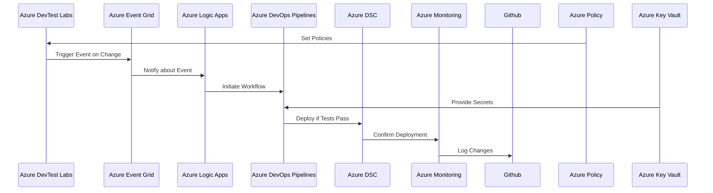
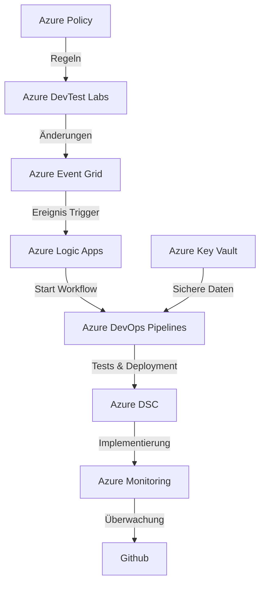

# integration-demo

```mermaid
  sequenceDiagram
  participant DevTestLabs as Azure DevTest Labs
  participant EventGrid as Azure Event Grid
  participant LogicApps as Azure Logic Apps
  participant DevOps as Azure DevOps Pipelines
  participant DSC as Azure DSC
  participant Monitoring as Azure Monitoring
  participant Github
  participant Policy as Azure Policy
  participant KeyVault as Azure Key Vault
  
  Policy->>DevTestLabs: Set Policies
  DevTestLabs->>EventGrid: Trigger Event on Change
  EventGrid->>LogicApps: Notify about Event
  LogicApps->>DevOps: Initiate Workflow
  KeyVault->>DevOps: Provide Secrets
  DevOps->>DSC: Deploy if Tests Pass
  DSC->>Monitoring: Confirm Deployment
  Monitoring->>Github: Log Changes
```

```mermaid
graph TD
  A[Azure DevTest Labs] -->|Änderungen| B[Azure Event Grid]
  B -->|Ereignis Trigger| C[Azure Logic Apps]
  C -->|Start Workflow| D[Azure DevOps Pipelines]
  D -->|Tests & Deployment| E[Azure DSC]
  E -->|Implementierung| F[Azure Monitoring]
  F -->|Überwachung| G[Github]
  H[Azure Policy] -->|Regeln| A
  I[Azure Key Vault] -->|Sichere Daten| D
```
